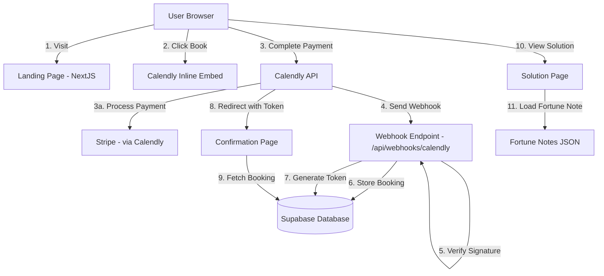
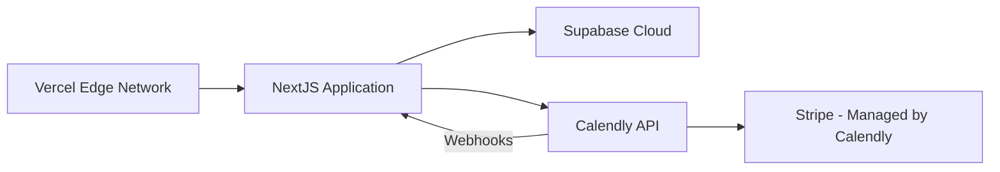

# Design Document: iTellFortune Landing Page

## Overview

iTellFortune is a NextJS-based fortune-telling consultation booking platform that provides an immersive, mystical user experience with seamless payment processing through Calendly Premium. The application uses shadcn/ui as its component library for all UI elements, ensuring accessibility and consistency while maintaining custom animations through Motion.js. The application consists of three primary user flows:

1. **Discovery Flow**: Users land on an immersive landing page with fullscreen video backgrounds, smooth scroll animations powered by Motion.js, shadcn/ui Card components for content display, and consultation category information
2. **Booking Flow**: Users book consultations through Calendly inline embed with integrated payment processing (Calendly handles all payment processing through their Stripe integration)
3. **Confirmation Flow**: After payment, users receive a unique confirmation token and access personalized content including welcome video, fortune notes displayed in shadcn/ui Cards, and solution cards

The system architecture follows a serverless NextJS pattern deployed on Vercel, with Supabase for data persistence and Calendly webhooks for secure booking event reception. The fortune teller receives instant alerts via Calendly mobile app and SMS for immediate client callback. All UI components use shadcn/ui primitives (Button, Card, Form, etc.) with Motion.js animations layered on top for enhanced user experience.

### Key Technical Decisions

- **NextJS App Router**: Leverages server components for optimal performance and SEO
- **shadcn/ui Component Library**: Provides accessible, customizable UI components built on Radix UI primitives with Tailwind CSS styling
- **Calendly Inline Embed**: Provides seamless booking experience without page redirects
- **Webhook-Based Architecture**: Ensures secure, server-to-server communication for booking data
- **Token-Based Confirmation**: Enables secure, stateless access to post-payment content
- **Motion.js Animations**: Delivers smooth, performant scroll-based animations integrated with shadcn/ui components
- **Supabase**: Provides real-time database with built-in authentication and security

## Architecture

### System Architecture Diagram



### Technology Stack

- **Frontend Framework**: NextJS 14+ with App Router
- **Package Manager**: Bun (v1.3.0) — use `bun` for ALL commands (`bun add`, `bun run`, `bunx`). Never use `npm` or `yarn`.
- **Component Library**: shadcn/ui (radix-maia style) — use shadcn/ui components for all UI elements (Button, Card, Form, etc.)
- **Styling**: Tailwind CSS v4 with mystical premium color palette (cosmic purples, mystic gold, celestial accents)
- **Animation**: Motion.js for scroll-based animations, stagger effects, and parallax (`useScroll`/`useTransform`)
- **Database**: Supabase (PostgreSQL) — all DB operations via Supabase MCP tools. database is alredy configured. check using mcp tool
- **Payment Processing**: Handled entirely by Calendly (Calendly integrates with Stripe internally)
- **Booking System**: Calendly Premium with inline embed
- **Deployment**: Vercel
- **Video Hosting**: YouTube unlisted video links
- **Testing**: fast-check for property-based tests (`bun add -D fast-check`)

## MCP Tools Usage

During implementation, the coding agent MUST use the following MCP tools automatically — do not skip these lookups.

### Ref MCP — Documentation Lookup

Use **before implementing any feature** that involves an external library or API. Always look up the relevant docs first to ensure correct API usage.

| Tool                               | When to Use                                                                                                        |
| ---------------------------------- | ------------------------------------------------------------------------------------------------------------------ |
| `mcp_Ref_ref_search_documentation` | Search for docs on NextJS, Tailwind CSS v4, Motion.js, react-calendly, Supabase JS client, Calendly API, shadcn/ui |
| `mcp_Ref_ref_read_url`             | Read a specific documentation URL returned from a search                                                           |

**Trigger points**:

- Task 2: Look up shadcn/ui installation and configuration docs, then Tailwind CSS v4 configuration before setting up the design system
- Task 3: Look up shadcn/ui Button component docs, then Motion.js entrance animation docs before building HeroSection
- Task 4: Look up shadcn/ui Card component docs, then Motion.js scroll animation and stagger docs before building category/social proof sections
- Task 6: Look up Motion.js `useScroll`/`useTransform` docs before implementing parallax
- Task 7: Look up react-calendly `InlineWidget` docs before building the embed component
- Task 9: Look up Calendly webhook payload structure and signature verification docs
- Before implementing any component: Look up the corresponding shadcn/ui component documentation

### Supabase MCP — All Database Operations

Use for **every** database operation — never write raw SQL migrations or run queries manually.

| Tool                                     | When to Use                                                  |
| ---------------------------------------- | ------------------------------------------------------------ |
| `mcp_supabase_apply_migration`           | Create or alter tables, apply RLS policies                   |
| `mcp_supabase_execute_sql`               | Run test queries, verify data insertion, debug token lookups |
| `mcp_supabase_list_tables`               | Inspect existing schema before writing migrations            |
| `mcp_supabase_generate_typescript_types` | Generate TypeScript types after any schema change            |
| `mcp_supabase_get_advisors`              | Check for security issues after applying RLS policies        |

**Trigger points**:

- Task 8: Use `mcp_supabase_apply_migration` to create the bookings table and RLS policies, then `mcp_supabase_generate_typescript_types` and `mcp_supabase_get_advisors`
- Task 9: Use `mcp_supabase_execute_sql` to test webhook insertion logic
- Task 10: Use `mcp_supabase_execute_sql` to test token-based queries

---

### Deployment Architecture

**Setup Note**: NextJS is installed directly in the current directory (project root) using `bunx create-next-app@latest .` — do not create a subdirectory. A git repo already exists at `https://github.com/jamiul-islam/fortune-teller.git`.



## Components and Interfaces

### Frontend Components

#### 1. Landing Page Components

**HeroSection Component**

```typescript
interface HeroSectionProps {
  videoUrl: string;
  fallbackImageUrl: string;
  title: string;
  subtitle: string;
  ctaText: string;
  onCtaClick: () => void;
}
```

Responsibilities:

- Display fullscreen (100vh) video background with autoplay
- Render title, subtitle, and shadcn/ui Button for CTA
- Handle video loading errors with fallback image
- Optimize video loading for performance
- Integrate Motion.js animations with shadcn/ui components

**ConsultationCategoriesSection Component**

```typescript
interface Category {
  id: string;
  title: string;
  subcategories: string[];
}

interface ConsultationCategoriesSectionProps {
  categories: Category[];
}
```

Responsibilities:

- Display consultation categories for marketing purposes
- Render category cards using shadcn/ui Card component
- Apply scroll-based animations using Motion.js on shadcn/ui Cards
- Maintain 100vh section height

**SocialProofSection Component**

```typescript
interface Testimonial {
  id: string;
  clientName: string;
  content: string;
  rating?: number;
}

interface SocialProofSectionProps {
  testimonials: Testimonial[];
}
```

Responsibilities:

- Display client testimonials
- Render testimonial cards using shadcn/ui Card component with animations
- Maintain 100vh section height

**TrustSection Component**

```typescript
interface TrustIndicator {
  id: string;
  icon: string;
  title: string;
  description: string;
}

interface TrustSectionProps {
  indicators: TrustIndicator[];
}
```

Responsibilities:

- Display trust indicators (confidentiality, immediate response, personalized guidance)
- Render indicator cards using shadcn/ui Card component with icons
- Maintain 100vh section height

**FooterSection Component**

```typescript
interface FooterLink {
  id: string;
  label: string;
  href: string;
}

interface FooterSectionProps {
  links: FooterLink[];
}
```

Responsibilities:

- Display footer links using shadcn/ui components (Legal notice, Privacy policy, Contact)
- Handle navigation to information pages

#### 2. Booking Components

**CalendlyInlineEmbed Component**

```typescript
interface CalendlyInlineEmbedProps {
  calendlyUrl: string;
  prefill?: {
    name?: string;
    email?: string;
  };
  onEventScheduled?: (event: CalendlyEvent) => void;
}
```

Responsibilities:

- Render Calendly inline embed widget wrapped in shadcn/ui container components
- Configure Calendly with custom fields and pricing (pricing configured in Calendly dashboard)
- Handle post-booking events
- Integrate with Calendly JavaScript SDK

#### 3. Confirmation Page Components

**ConfirmationPage Component**

```typescript
interface ConfirmationPageProps {
  token: string;
}

interface BookingDetails {
  firstName: string;
  lastName: string;
  email: string;
  phone: string;
  dateOfBirth: string;
  duration: 15 | 30 | 60;
  motherFirstName?: string;
  motherLastName?: string;
  motherDateOfBirth?: string;
  bookingTimestamp: string;
}
```

Responsibilities:

- Fetch booking details using confirmation token
- Display welcome video
- Render navigation buttons using shadcn/ui Button component ("Your Solution", "New Consultation")
- Handle token validation errors with shadcn/ui error components

**SolutionPage Component**

```typescript
interface SolutionPageProps {
  token: string;
}

interface SolutionData {
  solutionCardUrl: string;
  personalizedVideoUrl?: string;
  fortuneNote: string;
  bookingDetails: BookingDetails;
}
```

Responsibilities:

- Fetch solution data using confirmation token
- Display solution card using shadcn/ui Card component
- Display personalized video (if available)
- Display fortune note from JSON in shadcn/ui Card
- Display reassuring final message
- Provide discreet link using shadcn/ui Button to book another consultation

### Backend API Routes

#### 1. Webhook Endpoint

**Route**: `/api/webhooks/calendly`

**Method**: POST

**Request Headers**:

```typescript
{
  'Calendly-Webhook-Signature': string;
  'Content-Type': 'application/json';
}
```

**Request Body** (Calendly Webhook Payload):

```typescript
interface CalendlyWebhookPayload {
  event: "invitee.created";
  payload: {
    event_uri: string;
    invitee: {
      uri: string;
      email: string;
      name: string;
      first_name: string;
      last_name: string;
      created_at: string;
      questions_and_answers: Array<{
        question: string;
        answer: string;
      }>;
    };
    event: {
      uri: string;
      name: string;
      start_time: string;
      end_time: string;
    };
  };
}
```

**Response**:

```typescript
{
  success: boolean;
  message: string;
  confirmationToken?: string;
}
```

**Responsibilities**:

- Verify webhook signature using Calendly signing key
- Extract booking fields from webhook payload
- Map custom questions to database fields (DOB, mother's info)
- Generate unique confirmation token
- Store booking in Supabase
- Return success response

**Security Considerations**:

- Validate webhook signature before processing
- Log failed signature verifications
- Rate limit webhook endpoint
- Sanitize all input data

#### 2. Booking Details Endpoint

**Route**: `/api/bookings/[token]`

**Method**: GET

**Query Parameters**:

```typescript
{
  token: string; // Confirmation token
}
```

**Response**:

```typescript
{
  success: boolean;
  data?: BookingDetails;
  error?: string;
}
```

**Responsibilities**:

- Validate confirmation token
- Check token expiration (7 days)
- Fetch booking details from Supabase
- Return booking data or error

**Security Considerations**:

- Validate token format
- Check token expiration
- Rate limit requests
- Return generic error messages (avoid leaking information)

#### 3. Fortune Note Endpoint

**Route**: `/api/fortune-notes/random`

**Method**: GET

**Response**:

```typescript
{
  fortuneNote: string;
}
```

**Responsibilities**:

- Load fortune notes from JSON file
- Select random fortune note
- Return fortune note text

## Data Models

### Supabase Database Schema

#### Bookings Table

```sql
CREATE TABLE bookings (
  id UUID PRIMARY KEY DEFAULT gen_random_uuid(),
  confirmation_token VARCHAR(255) UNIQUE NOT NULL,
  calendly_event_uri VARCHAR(500) UNIQUE NOT NULL,

  -- Required fields
  first_name VARCHAR(100) NOT NULL,
  last_name VARCHAR(100) NOT NULL,
  email VARCHAR(255) NOT NULL,
  phone VARCHAR(50) NOT NULL,
  date_of_birth DATE NOT NULL,

  -- Optional fields
  mother_first_name VARCHAR(100),
  mother_last_name VARCHAR(100),
  mother_date_of_birth DATE,

  -- Booking details
  duration INTEGER NOT NULL CHECK (duration IN (15, 30, 60)),
  booking_timestamp TIMESTAMPTZ NOT NULL,

  -- Metadata
  created_at TIMESTAMPTZ DEFAULT NOW(),
  updated_at TIMESTAMPTZ DEFAULT NOW(),
  token_expires_at TIMESTAMPTZ NOT NULL,

  -- Indexes
  INDEX idx_confirmation_token (confirmation_token),
  INDEX idx_email (email),
  INDEX idx_booking_timestamp (booking_timestamp)
);
```

#### Row Level Security (RLS) Policies

```sql
-- Enable RLS
ALTER TABLE bookings ENABLE ROW LEVEL SECURITY;

-- Policy: Allow webhook endpoint to insert bookings
CREATE POLICY "Allow webhook inserts" ON bookings
  FOR INSERT
  WITH CHECK (true);

-- Policy: Allow reading bookings with valid token
CREATE POLICY "Allow token-based reads" ON bookings
  FOR SELECT
  USING (
    confirmation_token = current_setting('request.jwt.claim.token', true)
    AND token_expires_at > NOW()
  );
```

### Fortune Notes JSON Structure

**File**: `/config/fortune-notes.json`

```json
{
  "fortuneNotes": {
    "en": [
      "Your path is opening. The confusion you feel now is temporary, and clarity is already moving toward you.",
      "You are protected. The energy around you is shifting in your favor, even if you don't see it yet.",
      "Your situation is solvable. A breakthrough is forming, and the pressure you feel will soon release.",
      "Someone is thinking about you more than you realize. A reconnection or understanding is approaching.",
      "Your future is not blocked — it is reorganizing itself to bring you something better than what you lost.",
      "Your health and energy will rise again. Your body and spirit are entering a phase of recovery and strength.",
      "Success is coming. A small decision or change will unlock a much bigger opportunity for you.",
      "Your heart will heal. What feels heavy today will soon feel lighter, and emotional balance will return.",
      "You are not alone. A guiding force is watching over you and helping you move toward the right direction.",
      "Your intuition is waking up. Trust the signs you're receiving — they are leading you exactly where you need to go."
    ],
    "fr": [
      "Votre chemin s'ouvre. La confusion que vous ressentez maintenant est temporaire, et la clarté vient déjà vers vous.",
      "Vous êtes protégé. L'énergie autour de vous change en votre faveur, même si vous ne le voyez pas encore.",
      "Votre situation est résoluble. Une percée se forme, et la pression que vous ressentez va bientôt se relâcher.",
      "Quelqu'un pense à vous plus que vous ne le réalisez. Une reconnexion ou une compréhension approche.",
      "Votre avenir n'est pas bloqué — il se réorganise pour vous apporter quelque chose de mieux que ce que vous avez perdu.",
      "Votre santé et votre énergie vont remonter. Votre corps et votre esprit entrent dans une phase de récupération et de force.",
      "Le succès arrive. Une petite décision ou un changement débloquera une opportunité beaucoup plus grande pour vous.",
      "Votre cœur guérira. Ce qui semble lourd aujourd'hui se sentira bientôt plus léger, et l'équilibre émotionnel reviendra.",
      "Vous n'êtes pas seul. Une force guide veille sur vous et vous aide à avancer dans la bonne direction.",
      "Votre intuition se réveille. Faites confiance aux signes que vous recevez — ils vous mènent exactement là où vous devez aller."
    ]
  }
}
```

### Calendly Custom Fields Configuration

The following custom fields must be configured in Calendly:

1. **Date of Birth** (required)
   - Type: Date
   - Question: "What is your date of birth?"

2. **Mother's First Name** (optional)
   - Type: Text
   - Question: "Mother's first name (optional)"

3. **Mother's Last Name** (optional)
   - Type: Text
   - Question: "Mother's last name (optional)"

4. **Mother's Date of Birth** (optional)
   - Type: Date
   - Question: "Mother's date of birth (optional)"

### Environment Variables

**Note**: `.env.local` already exists in the project root. Add the following keys to it:

```bash
# Calendly Configuration
NEXT_PUBLIC_CALENDLY_URL=https://calendly.com/your-account/consultation
CALENDLY_WEBHOOK_SIGNING_KEY=your_webhook_signing_key
CALENDLY_API_PERSONAL_ACCESS_TOKEN=your_personal_access_api_token
CALENDLY_OAUTH_CLIENT_ID=your_calendly_oauth_app_client_id
CALENDLY_OAUTH_CLIENT_SECRET=your_calendly_oauth_app_client_secret

# Supabase Configuration
NEXT_PUBLIC_SUPABASE_URL=your_supabase_url
NEXT_PUBLIC_SUPABASE_ANON_KEY=your_supabase_anon_key
SUPABASE_SERVICE_ROLE_KEY=your_service_role_key

# Application Configuration
NEXT_PUBLIC_BASE_URL=https://your-domain.com
TOKEN_EXPIRATION_DAYS=7

# Video URLs
NEXT_PUBLIC_HERO_VIDEO_URL=youtube_unlisted_link_1
NEXT_PUBLIC_WELCOME_VIDEO_URL=youtube_unlisted_link_2
```

**Note**: Stripe configuration is handled entirely within the Calendly dashboard. No Stripe API keys or integrations are needed in the NextJS application.

## Internationalization (i18n) Configuration

### NextJS Native i18n Setup

The application uses NextJS native i18n routing for bilingual support (English and French).

#### next.config.ts Configuration

```typescript
import type { NextConfig } from "next";

const nextConfig: NextConfig = {
  i18n: {
    locales: ["en", "fr"],
    defaultLocale: "en",
    localeDetection: true,
  },
};

export default nextConfig;
```

#### Language Structure

**Supported Locales**:

- `en` - English (default)
- `fr` - French

**Translation Files Location**: `/locales/{locale}/common.json`

Example structure:

```
/locales
  /en
    common.json
  /fr
    common.json
```

#### Translation File Structure

**File**: `/locales/en/common.json`

```json
{
  "header": {
    "title": "iTellFortune",
    "phone": "Call Us"
  },
  "hero": {
    "title": "Your future is trying to speak to you",
    "subtitle": "Clarity. Guidance. Immediate answers",
    "cta": "Book a Reading"
  },
  "categories": {
    "title": "What is your urgent concern today?",
    "love": {
      "title": "Love & Relationships",
      "items": [
        "Love problems",
        "Couple repair",
        "Reconciliation",
        "Soulmate guidance",
        "Breakups"
      ]
    },
    "career": {
      "title": "Career & Success",
      "items": [
        "Business success",
        "Career blockage",
        "Financial opportunities"
      ]
    },
    "health": {
      "title": "Health & Energy",
      "items": ["Natural healing", "Energy cleansing", "Emotional balance"]
    },
    "treatments": {
      "title": "Natural Treatments",
      "items": [
        "Natural healing for all illnesses",
        "Energy via natural treatment",
        "Feminine fertility",
        "Masculine fertility",
        "Feminine endurance",
        "Masculine endurance",
        "Natural recovery for complex conditions"
      ]
    },
    "destiny": {
      "title": "Destiny & Spirituality",
      "items": ["Luck", "Destiny", "Spiritual messages", "Life path"]
    },
    "questions": {
      "title": "Specific Questions",
      "items": ["Any personal question"]
    }
  },
  "socialProof": {
    "title": "They found their answers"
  },
  "trust": {
    "title": "A reliable and confidential consultation",
    "confidentiality": {
      "title": "Confidentiality",
      "description": "Your information is completely secure"
    },
    "immediate": {
      "title": "Immediate Response",
      "description": "Get your answers quickly"
    },
    "personalized": {
      "title": "Personalized Guidance",
      "description": "Tailored to your unique situation"
    }
  },
  "footer": {
    "legal": "Legal notice",
    "privacy": "Privacy policy",
    "contact": "Contact"
  },
  "confirmation": {
    "title": "Thank you for booking",
    "yourSolution": "Your Solution",
    "newConsultation": "New Consultation"
  },
  "solution": {
    "title": "Your Personalized Solution",
    "bookAgain": "Book Another Reading"
  }
}
```

**File**: `/locales/fr/common.json`

```json
{
  "header": {
    "title": "iTellFortune",
    "phone": "Appelez-nous"
  },
  "hero": {
    "title": "Votre avenir essaie de vous parler",
    "subtitle": "Clarté. Guidance. Réponses immédiates",
    "cta": "Réserver une Lecture"
  },
  "categories": {
    "title": "Quelle est votre préoccupation urgente aujourd'hui?",
    "love": {
      "title": "Amour & Relations",
      "items": [
        "Problèmes d'amour",
        "Réparation de couple",
        "Réconciliation",
        "Guidance d'âme sœur",
        "Ruptures"
      ]
    },
    "career": {
      "title": "Carrière & Succès",
      "items": [
        "Succès commercial",
        "Blocage de carrière",
        "Opportunités financières"
      ]
    },
    "health": {
      "title": "Santé & Énergie",
      "items": [
        "Guérison naturelle",
        "Nettoyage énergétique",
        "Équilibre émotionnel"
      ]
    },
    "treatments": {
      "title": "Traitements Naturels",
      "items": [
        "Guérison naturelle pour toutes les maladies",
        "Énergie via traitement naturel",
        "Fertilité féminine",
        "Fertilité masculine",
        "Endurance féminine",
        "Endurance masculine",
        "Récupération naturelle pour conditions complexes"
      ]
    },
    "destiny": {
      "title": "Destin & Spiritualité",
      "items": ["Chance", "Destin", "Messages spirituels", "Chemin de vie"]
    },
    "questions": {
      "title": "Questions Spécifiques",
      "items": ["Toute question personnelle"]
    }
  },
  "socialProof": {
    "title": "Ils ont trouvé leurs réponses"
  },
  "trust": {
    "title": "Une consultation fiable et confidentielle",
    "confidentiality": {
      "title": "Confidentialité",
      "description": "Vos informations sont complètement sécurisées"
    },
    "immediate": {
      "title": "Réponse Immédiate",
      "description": "Obtenez vos réponses rapidement"
    },
    "personalized": {
      "title": "Guidance Personnalisée",
      "description": "Adaptée à votre situation unique"
    }
  },
  "footer": {
    "legal": "Mentions légales",
    "privacy": "Politique de confidentialité",
    "contact": "Contact"
  },
  "confirmation": {
    "title": "Merci pour votre réservation",
    "yourSolution": "Votre Solution",
    "newConsultation": "Nouvelle Consultation"
  },
  "solution": {
    "title": "Votre Solution Personnalisée",
    "bookAgain": "Réserver une Autre Lecture"
  }
}
```

#### Language Toggle Component

**Component**: `components/LanguageToggle.tsx`

```typescript
import { useRouter } from "next/router";
import { Button } from "@/components/ui/button";

export function LanguageToggle() {
  const router = useRouter();
  const { locale, pathname, query, asPath } = router;

  const toggleLanguage = () => {
    const newLocale = locale === "en" ? "fr" : "en";
    router.push({ pathname, query }, asPath, { locale: newLocale });
  };

  return (
    <Button
      variant="ghost"
      size="sm"
      onClick={toggleLanguage}
      className="font-semibold"
    >
      {locale === "en" ? "FR" : "EN"}
    </Button>
  );
}
```

#### Header Component Integration

The language toggle button should be integrated into the header component:

```typescript
import { LanguageToggle } from "@/components/LanguageToggle";
import { IconPhone } from "@tabler/icons-react";

export function HeaderSection() {
  return (
    <header className="fixed top-0 left-0 right-0 z-50 bg-background/80 backdrop-blur-sm">
      <div className="container mx-auto px-4 py-4 flex items-center justify-between">
        <h1 className="text-xl font-bold">iTellFortune</h1>
        <div className="flex items-center gap-4">
          <LanguageToggle />
          <a href="tel:+1234567890" className="flex items-center gap-2">
            <IconPhone size={20} />
          </a>
        </div>
      </div>
    </header>
  );
}
```

#### Using Translations in Components

```typescript
import { useTranslation } from "next-i18next";

export function HeroSection() {
  const { t } = useTranslation("common");

  return (
    <section>
      <h1>{t("hero.title")}</h1>
      <p>{t("hero.subtitle")}</p>
      <Button>{t("hero.cta")}</Button>
    </section>
  );
}
```

#### Fortune Notes API Update

The fortune notes API should return notes based on the user's locale:

```typescript
// /app/api/fortune-notes/random/route.ts
import { NextRequest, NextResponse } from "next/server";
import fortuneNotes from "@/config/fortune-notes.json";

export async function GET(request: NextRequest) {
  const locale =
    request.headers.get("accept-language")?.split(",")[0]?.split("-")[0] ||
    "en";
  const supportedLocale = locale === "fr" ? "fr" : "en";

  const notes = fortuneNotes.fortuneNotes[supportedLocale];
  const randomNote = notes[Math.floor(Math.random() * notes.length)];

  return NextResponse.json({ fortuneNote: randomNote });
}
```

#### Language Persistence

The user's language preference is automatically persisted by NextJS through:

1. URL locale prefix (e.g., `/en/`, `/fr/`)
2. Browser cookies (`NEXT_LOCALE`)
3. Locale detection based on `Accept-Language` header

#### Implementation Notes

- Use `next-i18next` library for translation management (install with `bun add next-i18next`)
- All user-facing strings must be externalized to translation files
- Fortune notes are stored in the bilingual JSON structure
- Language toggle appears in header before phone icon
- Default language is English when no preference is detected
- Locale is passed through all API calls for proper content delivery

## shadcn/ui Configuration and Theme Customization

### Installation and Setup

shadcn/ui is already configured in the project with the following settings:

```json
{
  "style": "radix-maia",
  "rsc": true,
  "tsx": true,
  "tailwind": {
    "config": "",
    "css": "app/globals.css",
    "baseColor": "olive",
    "cssVariables": true,
    "prefix": ""
  },
  "iconLibrary": "tabler",
  "aliases": {
    "components": "@/components",
    "utils": "@/lib/utils",
    "ui": "@/components/ui"
  }
}
```

### Adding New Components

To add new shadcn/ui components during implementation:

```bash
bunx shadcn@latest add button
bunx shadcn@latest add card
bunx shadcn@latest add form
bunx shadcn@latest add input
# etc.
```

### Integrating Motion.js with shadcn/ui Components

shadcn/ui components can be wrapped with Motion.js animation components:

```typescript
import { motion } from "motion/react";
import { Button } from "@/components/ui/button";
import { Card } from "@/components/ui/card";

// Animated Button
const MotionButton = motion(Button);

// Animated Card
const MotionCard = motion(Card);

// Usage
<MotionButton
  initial={{ opacity: 0, y: 20 }}
  animate={{ opacity: 1, y: 0 }}
  transition={{ duration: 0.5 }}
>
  Book a Reading
</MotionButton>

<MotionCard
  initial={{ opacity: 0, scale: 0.9 }}
  whileInView={{ opacity: 1, scale: 1 }}
  viewport={{ once: true }}
  transition={{ duration: 0.6 }}
>
  {/* Card content */}
</MotionCard>
```

### Component Usage Guidelines

1. **Always use shadcn/ui components** for UI elements instead of custom implementations
2. **Wrap shadcn/ui components with Motion.js** for animations (entrance, scroll-triggered, parallax)
3. **Customize component styles** using Tailwind CSS classes and the `className` prop
4. **Maintain accessibility** - shadcn/ui components are built with accessibility in mind
5. **Use the Button component** for all interactive buttons (CTA, navigation, forms)
6. **Use the Card component** for all card-based layouts (categories, testimonials, trust indicators, solution cards)
7. **Look up shadcn/ui docs** using Ref MCP before implementing each component

### Example Component Implementations

**Hero CTA Button with shadcn/ui + Motion.js:**

```typescript
import { motion } from "motion/react";
import { Button } from "@/components/ui/button";

const MotionButton = motion(Button);

export function HeroCTA() {
  return (
    <MotionButton
      size="lg"
      variant="default"
      initial={{ opacity: 0, y: 20 }}
      animate={{ opacity: 1, y: 0 }}
      transition={{ duration: 0.5, delay: 0.3 }}
      onClick={handleBooking}
    >
      Book a Reading
    </MotionButton>
  );
}
```

**Category Card with shadcn/ui + Motion.js:**

```typescript
import { motion } from "motion/react";
import { Card, CardHeader, CardTitle, CardContent } from "@/components/ui/card";

const MotionCard = motion(Card);

export function CategoryCard({ category, index }) {
  return (
    <MotionCard
      initial={{ opacity: 0, y: 50 }}
      whileInView={{ opacity: 1, y: 0 }}
      viewport={{ once: true }}
      transition={{ duration: 0.6, delay: index * 0.1 }}
      className="min-h-[200px]"
    >
      <CardHeader>
        <CardTitle>{category.title}</CardTitle>
      </CardHeader>
      <CardContent>
        <ul>
          {category.subcategories.map((sub) => (
            <li key={sub}>{sub}</li>
          ))}
        </ul>
      </CardContent>
    </MotionCard>
  );
}
```

## Correctness Properties

_A property is a characteristic or behavior that should hold true across all valid executions of a system—essentially, a formal statement about what the system should do. Properties serve as the bridge between human-readable specifications and machine-verifiable correctness guarantees._

### Property 1: Webhook Signature Verification

_For any_ incoming webhook request, if the signature is invalid, the webhook endpoint should reject the request and return an error response without processing the payload.

**Validates: Requirements 4.2, 4.6**

### Property 2: Webhook Data Extraction Completeness

_For any_ valid Calendly webhook payload with a verified signature, the webhook endpoint should successfully extract all required booking fields (first name, last name, email, phone, date of birth), optional fields (mother's information), duration option, booking timestamp, and event URI.

**Validates: Requirements 4.3, 4.4, 4.5**

### Property 3: Booking Storage with Data Integrity

_For any_ valid booking data received from a webhook, when stored in Supabase, the record should contain all required fields (first name, last name, email, phone, date of birth, duration, booking timestamp, Calendly event URI) as non-null values, and the Calendly event URI should be unique across all bookings.

**Validates: Requirements 5.1, 5.2, 5.4, 5.5**

### Property 4: Optional Fields Nullability

_For any_ booking record in Supabase, the optional fields (mother's first name, mother's last name, mother's date of birth) can be null without causing storage or retrieval failures.

**Validates: Requirements 5.3**

### Property 5: Confirmation Token Uniqueness and Association

_For any_ booking stored in the database, a unique confirmation token should be generated and stored with the booking record, and querying by that token should return exactly that booking.

**Validates: Requirements 5.6, 5.7, 7.11**

### Property 6: Post-Payment Redirect with Token

_For any_ successful booking completion (with or without payment), the user should be redirected to a confirmation page URL that includes a valid confirmation token as a query parameter in the format `/confirmation?token={token}`.

**Validates: Requirements 7.1, 9.2, 9.4**

### Property 7: Fortune Note Selection Validity

_For any_ solution page load, the displayed fortune note should be one of the exactly 10 fortune notes defined in the JSON configuration file.

**Validates: Requirements 6.2, 6.3, 7.7**

### Property 8: Conditional Video Display

_For any_ solution page with a personalized video URL present in the booking data, the personalized video element should be rendered on the page.

**Validates: Requirements 7.6**

### Property 9: Token-Based Access Control

_For any_ confirmation token, the booking details API should return booking data only if the token is valid, matches a booking record, and has not expired (is less than 7 days old), otherwise it should return an error response.

**Validates: Requirements 8.2, 8.3, 8.5, 8.6**

### Property 10: Complete Booking Data Retrieval

_For any_ valid and non-expired confirmation token, the API should return all booking fields (first name, last name, email, phone, date of birth, mother's information if present, duration option, and booking timestamp).

**Validates: Requirements 8.4**

### Property 11: Color Palette Compliance

_For any_ color value used in the landing page styles, it should be from the mystical premium palette (cosmic purples, mystic gold, celestial blue, ethereal pink, cosmic teal, pearl white, soft gray, deep space).

**Validates: Requirements 13.3**

### Property 12: Section Height Consistency

_For any_ major section on the landing page (hero, categories, social proof, trust), the section should have a height of 100vh across all viewport sizes.

**Validates: Requirements 1.5, 10.3, 11.3, 13.4, 14.4**

### Property 13: Responsive Layout Integrity

_For any_ viewport width between 320px and 3840px, the landing page should render without horizontal overflow, broken layouts, or inaccessible content.

**Validates: Requirements 14.1, 14.2, 14.3**

### Property 14: Touch Target Sizing on Mobile

_For any_ interactive element (button, link) on the landing page when viewport width is below 768px, the touch target should be at least 44x44 pixels to meet accessibility standards.

**Validates: Requirements 14.5**

### Property 15: Footer Navigation Consistency

_For any_ footer link clicked, the navigation should direct to the corresponding page (Legal notice, Privacy policy, or Contact), and the footer should be present at the bottom of every page.

**Validates: Requirements 15.2, 15.3**

### Property 16: Video Fallback on Load Failure

_For any_ video element that fails to load (network error, unsupported format, etc.), a fallback image should be displayed in its place.

**Validates: Requirements 16.2**

### Property 17: Below-Fold Video Lazy Loading

_For any_ video element positioned below the initial viewport (below the fold), the video should not begin loading until the user scrolls near that section.

**Validates: Requirements 17.2**

### Property 18: Image Optimization

_For any_ image asset on the landing page, it should be served in an optimized web format (WebP, AVIF, or optimized JPEG/PNG) with appropriate compression.

**Validates: Requirements 17.3**

### Property 19: API Error Handling

_For any_ API call (to Supabase, Calendly, or internal endpoints) that fails or times out, the system should handle the error gracefully without crashing and should provide appropriate user feedback or logging.

**Validates: Requirements 18.4**

### Property 20: Bilingual Language Support

_For any_ text content displayed on the landing page, confirmation page, or solution page, including fortune notes, the language should be either English or French based on the user's selected locale, and all UI strings should have translations in both languages.

**Validates: Requirements 19.1, 19.2, 19.5, 19.6, 19.7**

## Error Handling

### Frontend Error Handling

#### Video Loading Errors

- **Scenario**: Hero video or welcome video fails to load
- **Handling**: Display fallback image, log error to monitoring service
- **User Experience**: Seamless transition to static image without blocking page functionality

#### Calendly Embed Loading Errors

- **Scenario**: Calendly widget fails to initialize
- **Handling**: Display error message with retry button, provide alternative booking link
- **User Experience**: "Unable to load booking system. Please try again or contact us directly."

#### API Request Failures

- **Scenario**: Booking details API returns error or times out
- **Handling**: Display user-friendly error message, provide retry mechanism
- **User Experience**: "Unable to load your booking details. Please check your link or contact support."

#### Invalid Confirmation Token

- **Scenario**: User accesses confirmation page with invalid/expired token
- **Handling**: Display clear error message, provide link to book new consultation
- **User Experience**: "This confirmation link has expired or is invalid. Please book a new consultation."

#### Network Connectivity Issues

- **Scenario**: User loses internet connection
- **Handling**: Display offline indicator, queue actions for retry when connection restored
- **User Experience**: "You appear to be offline. Please check your connection."

### Backend Error Handling

#### Webhook Signature Verification Failure

- **Scenario**: Incoming webhook has invalid signature
- **Handling**:
  - Return 401 Unauthorized response
  - Log security violation with request details
  - Alert monitoring system for potential attack
- **Response**: `{ "error": "Invalid signature" }`

#### Webhook Payload Validation Failure

- **Scenario**: Webhook payload missing required fields
- **Handling**:
  - Return 400 Bad Request response
  - Log validation error with payload details
  - Do not store incomplete booking
- **Response**: `{ "error": "Invalid payload structure" }`

#### Database Connection Failure

- **Scenario**: Supabase connection fails or times out
- **Handling**:
  - Return 503 Service Unavailable response
  - Implement exponential backoff retry logic
  - Log error to monitoring service
  - Alert on-call engineer if persistent
- **Response**: `{ "error": "Service temporarily unavailable" }`

#### Duplicate Booking Prevention

- **Scenario**: Webhook received multiple times for same event (Calendly retry)
- **Handling**:
  - Check for existing booking by Calendly event URI
  - If exists, return 200 OK without creating duplicate
  - Log duplicate attempt for monitoring
- **Response**: `{ "success": true, "message": "Booking already processed" }`

#### Token Generation Collision

- **Scenario**: Generated token already exists (extremely rare)
- **Handling**:
  - Regenerate token with additional entropy
  - Retry up to 3 times
  - If still fails, log critical error and alert
- **Response**: Continue processing with new token

#### Fortune Notes File Missing

- **Scenario**: Fortune notes JSON file not found
- **Handling**:
  - Log critical error
  - Return default fallback fortune note
  - Alert engineering team
- **Fallback**: "Your path is opening. Clarity is coming your way."

### Error Logging and Monitoring

#### Logging Strategy

- **Info Level**: Successful bookings, token generation, normal operations
- **Warning Level**: Retry attempts, fallback activations, non-critical failures
- **Error Level**: API failures, database errors, validation failures
- **Critical Level**: Security violations, data integrity issues, system unavailability

#### Monitoring Alerts

- **Immediate Alert**: Webhook signature verification failures (potential security breach)
- **Immediate Alert**: Database connection failures lasting > 1 minute
- **Daily Digest**: Video loading failures, API timeout rates, token expiration access attempts
- **Weekly Report**: Performance metrics, error rates, user flow completion rates

### Rate Limiting

#### Webhook Endpoint

- **Limit**: 100 requests per minute per IP
- **Handling**: Return 429 Too Many Requests
- **Purpose**: Prevent abuse and DDoS attacks

#### Booking Details API

- **Limit**: 10 requests per minute per token
- **Handling**: Return 429 Too Many Requests
- **Purpose**: Prevent token enumeration attacks

#### Fortune Notes API

- **Limit**: 60 requests per minute per IP
- **Handling**: Return 429 Too Many Requests
- **Purpose**: Prevent resource exhaustion

## Testing Strategy

### Overview

The testing strategy employs a dual approach combining unit tests for specific examples and edge cases with property-based tests for universal correctness guarantees. This ensures both concrete behavior validation and comprehensive input coverage.

### Property-Based Testing

#### Framework Selection

- **JavaScript/TypeScript**: fast-check library — install with `bun add -D fast-check`
- **Configuration**: Minimum 100 iterations per property test
- **Tagging**: Each test references its design document property

#### Property Test Implementation

**Property 1: Webhook Signature Verification**

```typescript
// Feature: fortune-telling-landing-page, Property 1: Webhook signature verification
test("rejects webhooks with invalid signatures", async () => {
  await fc.assert(
    fc.asyncProperty(
      fc.record({
        payload: fc.object(),
        invalidSignature: fc.string(),
      }),
      async ({ payload, invalidSignature }) => {
        const response = await webhookHandler({
          body: payload,
          headers: { "Calendly-Webhook-Signature": invalidSignature },
        });
        expect(response.status).toBe(401);
      },
    ),
    { numRuns: 100 },
  );
});
```

**Property 2: Webhook Data Extraction Completeness**

```typescript
// Feature: fortune-telling-landing-page, Property 2: Webhook data extraction completeness
test("extracts all required fields from valid webhook payloads", async () => {
  await fc.assert(
    fc.asyncProperty(
      validCalendlyWebhookGenerator(),
      async (webhookPayload) => {
        const extracted = await extractBookingData(webhookPayload);
        expect(extracted.firstName).toBeDefined();
        expect(extracted.lastName).toBeDefined();
        expect(extracted.email).toBeDefined();
        expect(extracted.phone).toBeDefined();
        expect(extracted.dateOfBirth).toBeDefined();
        expect(extracted.duration).toBeOneOf([15, 30, 60]);
        expect(extracted.eventUri).toBeDefined();
      },
    ),
    { numRuns: 100 },
  );
});
```

**Property 5: Confirmation Token Uniqueness and Association**

```typescript
// Feature: fortune-telling-landing-page, Property 5: Confirmation token uniqueness and association
test("generates unique tokens and maintains booking association", async () => {
  await fc.assert(
    fc.asyncProperty(
      fc.array(validBookingDataGenerator(), { minLength: 2, maxLength: 10 }),
      async (bookings) => {
        const tokens = [];
        for (const booking of bookings) {
          const token = await storeBookingAndGenerateToken(booking);
          tokens.push(token);

          // Verify token retrieves correct booking
          const retrieved = await getBookingByToken(token);
          expect(retrieved.email).toBe(booking.email);
        }

        // Verify all tokens are unique
        const uniqueTokens = new Set(tokens);
        expect(uniqueTokens.size).toBe(tokens.length);
      },
    ),
    { numRuns: 100 },
  );
});
```

**Property 9: Token-Based Access Control**

```typescript
// Feature: fortune-telling-landing-page, Property 9: Token-based access control
test("enforces token validation and expiration", async () => {
  await fc.assert(
    fc.asyncProperty(
      fc.oneof(
        fc.constant("invalid-token"),
        fc.constant("expired-token"),
        fc.constant("non-existent-token"),
      ),
      async (invalidToken) => {
        const response = await getBookingDetails(invalidToken);
        expect(response.success).toBe(false);
        expect(response.error).toBeDefined();
      },
    ),
    { numRuns: 100 },
  );
});
```

**Property 13: Responsive Layout Integrity**

```typescript
// Feature: fortune-telling-landing-page, Property 13: Responsive layout integrity
test('renders without overflow across viewport sizes', async () => {
  await fc.assert(
    fc.asyncProperty(
      fc.integer({ min: 320, max: 3840 }),
      async (viewportWidth) => {
        const { container } = render(<LandingPage />);
        setViewportWidth(viewportWidth);

        const bodyWidth = document.body.scrollWidth;
        expect(bodyWidth).toBeLessThanOrEqual(viewportWidth);
      }
    ),
    { numRuns: 100 }
  );
});
```

### Unit Testing

#### Component Tests

**Hero Section**

- Renders with correct title and subtitle text
- Displays shadcn/ui Button CTA with correct label
- Handles video load failure with fallback image
- Maintains 100vh height
- Triggers booking flow on CTA click
- Motion.js animations integrate correctly with shadcn/ui Button

**Calendly Embed**

- Initializes with correct configuration
- Uses inline embed method (not popup)
- Handles embed load failures gracefully
- Passes prefill data correctly
- shadcn/ui container components render correctly

**Confirmation Page**

- Displays welcome video
- Shows shadcn/ui Button navigation buttons
- Handles invalid token with shadcn/ui error components
- Fetches and displays booking details in shadcn/ui Card

**Solution Page**

- Displays solution card using shadcn/ui Card component
- Shows personalized video when available
- Displays fortune note in shadcn/ui Card
- Provides shadcn/ui Button link to book another consultation

#### API Route Tests

**Webhook Endpoint**

- Accepts valid webhook with correct signature
- Rejects webhook with invalid signature
- Extracts all booking fields correctly
- Handles duplicate webhooks idempotently
- Returns appropriate error codes

**Booking Details Endpoint**

- Returns booking data for valid token
- Returns error for invalid token
- Returns error for expired token (> 7 days)
- Includes all booking fields in response

#### Integration Tests

**End-to-End Booking Flow**

1. User lands on page
2. Clicks "Book a Reading"
3. Calendly embed loads
4. User completes booking (mocked)
5. Webhook received and processed
6. User redirected to confirmation page called "welcome"
7. Booking details displayed correctly

**Token Lifecycle**

1. Booking created via webhook
2. Token generated and stored
3. Token used to access confirmation page
4. Token used to access solution page
5. Token expires after 7 days
6. Expired token rejected

### Test Data Generators

#### Valid Calendly Webhook Generator

```typescript
const validCalendlyWebhookGenerator = () =>
  fc.record({
    event: fc.constant("invitee.created"),
    payload: fc.record({
      event_uri: fc.webUrl(),
      invitee: fc.record({
        email: fc.emailAddress(),
        first_name: fc.string({ minLength: 1, maxLength: 50 }),
        last_name: fc.string({ minLength: 1, maxLength: 50 }),
        questions_and_answers: fc.array(
          fc.record({
            question: fc.string(),
            answer: fc.string(),
          }),
        ),
      }),
      event: fc.record({
        start_time: fc.date().map((d) => d.toISOString()),
        end_time: fc.date().map((d) => d.toISOString()),
      }),
    }),
  });
```

#### Valid Booking Data Generator

```typescript
const validBookingDataGenerator = () =>
  fc.record({
    firstName: fc.string({ minLength: 1, maxLength: 50 }),
    lastName: fc.string({ minLength: 1, maxLength: 50 }),
    email: fc.emailAddress(),
    phone: fc.string({ minLength: 10, maxLength: 15 }),
    dateOfBirth: fc.date({
      min: new Date("1920-01-01"),
      max: new Date("2010-01-01"),
    }),
    duration: fc.constantFrom(15, 30, 60),
    motherFirstName: fc.option(fc.string({ minLength: 1, maxLength: 50 })),
    motherLastName: fc.option(fc.string({ minLength: 1, maxLength: 50 })),
    motherDateOfBirth: fc.option(
      fc.date({ min: new Date("1900-01-01"), max: new Date("1990-01-01") }),
    ),
  });
```

### Test Coverage Goals

- **Unit Test Coverage**: Minimum 80% code coverage
- **Property Test Coverage**: All 20 correctness properties implemented
- **Integration Test Coverage**: All critical user flows covered
- **E2E Test Coverage**: Complete booking flow from landing to confirmation

### Continuous Integration

- **Pre-commit**: Run unit tests and linting
- **Pull Request**: Run full test suite including property tests
- **Pre-deployment**: Run E2E tests against staging environment
- **Post-deployment**: Run smoke tests against production

### Performance Testing

- **Lighthouse CI**: Automated performance testing on every deployment
- **Target Scores**: Performance > 80, Accessibility > 90, Best Practices > 90, SEO > 90
- **Load Testing**: Webhook endpoint should handle 100 requests/minute
- **Video Loading**: Hero video should start playing within 3 seconds on 3G connection
