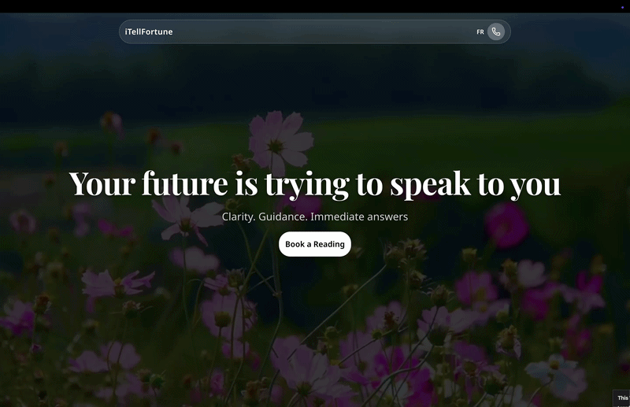

# iTellFortune - Fortune Telling Consultation Platform



A modern, full-stack web application for booking and managing fortune telling consultations. Built with Next.js 16, featuring real-time booking integration with Calendly, personalized video messages, and a beautiful, animated user interface.

## ✨ Features

### 🎯 Core Functionality

- **Seamless Booking Flow**: Integrated Calendly booking system with custom UI
- **Personalized Solutions**: Random fortune notes delivered after consultation
- **Video Integration**: Welcome videos and personalized video message support
- **Multi-language Support**: Built-in internationalization (English/French)
- **Real-time Updates**: Booking status tracking and confirmation system

### 🎨 Design & UX

- **Modern UI**: Glassmorphism effects, particle animations, and smooth transitions
- **Responsive Design**: Fully optimized for desktop, tablet, and mobile devices
- **Motion Animations**: Framer Motion for fluid, professional animations
- **Accessibility**: WCAG-compliant components with proper ARIA labels

### 🔐 Backend & Data

- **Supabase Integration**: PostgreSQL database with real-time capabilities
- **Secure Token System**: 7-day expiring tokens for booking confirmations
- **API Routes**: RESTful endpoints for bookings and fortune notes
- **Type Safety**: Full TypeScript implementation

## 🛠️ Tech Stack

### Frontend

- **Framework**: Next.js 16.2 (App Router)
- **UI Library**: React 19.2
- **Styling**: Tailwind CSS 4.2
- **Animations**: Framer Motion (motion)
- **Components**: Radix UI, shadcn/ui
- **Icons**: Tabler Icons, Lucide React

### Backend

- **Database**: Supabase (PostgreSQL)
- **API**: Next.js API Routes
- **Booking**: Calendly API Integration
- **Authentication**: Supabase Auth

### Development

- **Runtime**: Bun
- **Language**: TypeScript 6.0
- **Testing**: Vitest, Testing Library
- **Linting**: ESLint
- **Code Quality**: TypeScript ESLint

## 📦 Installation

### Prerequisites

- [Bun](https://bun.sh) v1.3.0 or higher
- Node.js 18+ (for compatibility)
- Supabase account
- Calendly account with API access

### Setup

1. **Clone the repository**

```bash
git clone <repository-url>
cd fortune_telling
```

2. **Install dependencies**

```bash
bun install
```

3. **Configure environment variables**

Create a `.env.local` file in the root directory:

```env
# Calendly Configuration
NEXT_PUBLIC_CALENDLY_URL=your_calendly_url
CALENDLY_API_PERSONAL_ACCESS_TOKEN=your_calendly_token

# Supabase Configuration
NEXT_PUBLIC_SUPABASE_URL=your_supabase_url
NEXT_PUBLIC_SUPABASE_ANON_KEY=your_supabase_anon_key
SUPABASE_SERVICE_ROLE_KEY=your_supabase_service_role_key

# Application Configuration
NEXT_PUBLIC_BASE_URL=http://localhost:3000
TOKEN_EXPIRATION_DAYS=7

# Video URLs
NEXT_PUBLIC_HERO_VIDEO_URL=your_hero_video_url
NEXT_PUBLIC_WELCOME_VIDEO_URL=your_welcome_video_url
```

4. **Set up Supabase database**

Run the migrations in your Supabase project to create the necessary tables:

- `bookings` table for storing consultation bookings
- Token-based confirmation system

5. **Run the development server**

```bash
bun run dev
```

Open [http://localhost:3000](http://localhost:3000) to view the application.

## 🚀 Usage

### Development

```bash
bun run dev          # Start development server
bun run build        # Build for production
bun run start        # Start production server
bun run lint         # Run ESLint
bun run test         # Run tests
bun run test:watch   # Run tests in watch mode
```

### Project Structure

```
fortune_telling/
├── app/                      # Next.js app directory
│   ├── api/                 # API routes
│   │   ├── bookings/       # Booking endpoints
│   │   └── fortune-notes/  # Fortune note endpoints
│   ├── confirmation/        # Confirmation page
│   ├── solution/           # Solution delivery page
│   └── page.tsx            # Homepage
├── components/              # React components
│   ├── booking/            # Booking-related components
│   ├── sections/           # Page sections
│   └── ui/                 # Reusable UI components
├── lib/                     # Utility functions
├── messages/                # i18n translations
├── types/                   # TypeScript types
└── config/                  # Configuration files
```

## 🎨 Key Features Breakdown

### Landing Page

- Hero section with fullscreen video background
- Consultation categories with particle effects
- Social proof testimonials
- Trust indicators (confidentiality, speed, personalization)
- Final CTA section

### Booking Flow

1. User clicks "Book a Reading"
2. Calendly modal opens with available time slots
3. User completes booking
4. Confirmation page with welcome video
5. Solution page with personalized fortune note

### Confirmation System

- Unique token generation for each booking
- 7-day token expiration
- Secure booking retrieval
- Personalized video message support

## 🧪 Testing

The project includes comprehensive testing setup:

```bash
# Run all tests
bun run test

# Run tests in watch mode
bun run test:watch

# Run tests with UI
bun run test -- --ui
```

## 🌐 Internationalization

The application supports multiple languages using `next-intl`:

- English (en)
- French (fr)

Add new languages by creating translation files in the `messages/` directory.

## 📱 Responsive Design

The application is fully responsive with breakpoints:

- Mobile: < 640px
- Tablet: 640px - 1024px
- Desktop: > 1024px

## 🔒 Security

- Environment variables for sensitive data
- Secure token-based confirmation system
- Supabase Row Level Security (RLS)
- API route protection
- Input validation and sanitization

## 🤝 Contributing

Contributions are welcome! Please follow these steps:

1. Fork the repository
2. Create a feature branch (`git checkout -b feature/amazing-feature`)
3. Commit your changes (`git commit -m 'Add amazing feature'`)
4. Push to the branch (`git push origin feature/amazing-feature`)
5. Open a Pull Request

## 📄 License

This project is private and proprietary.

## 🙏 Acknowledgments

- [Next.js](https://nextjs.org/) - React framework
- [Supabase](https://supabase.com/) - Backend infrastructure
- [Calendly](https://calendly.com/) - Booking system
- [Tailwind CSS](https://tailwindcss.com/) - Styling
- [Framer Motion](https://www.framer.com/motion/) - Animations
- [shadcn/ui](https://ui.shadcn.com/) - UI components

## 📞 Support

For support, please contact the development team or open an issue in the repository.

---

Built with ❤️ using [Bun](https://bun.sh)
